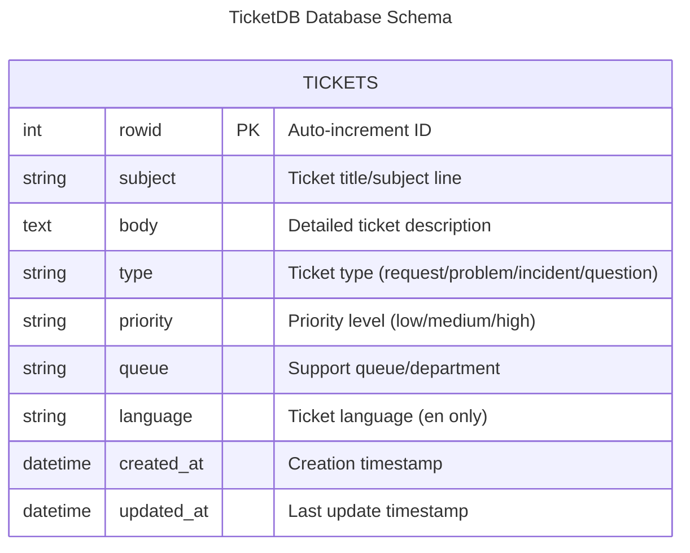
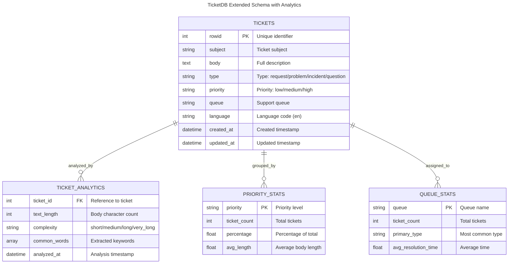
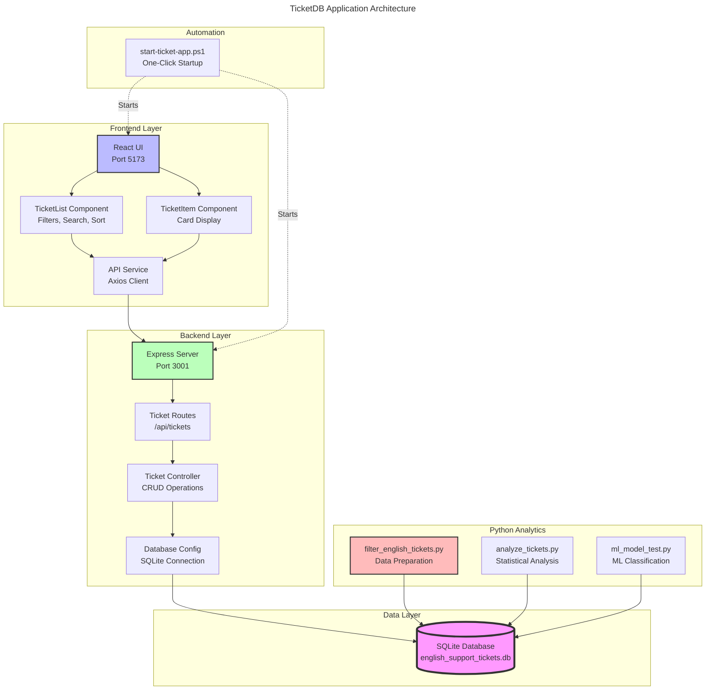
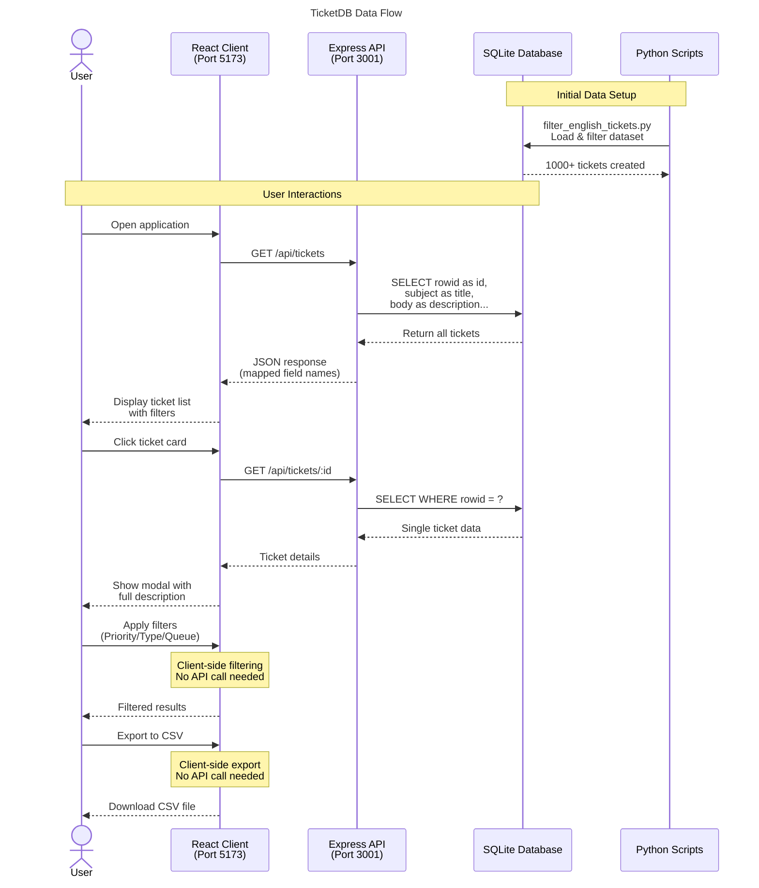
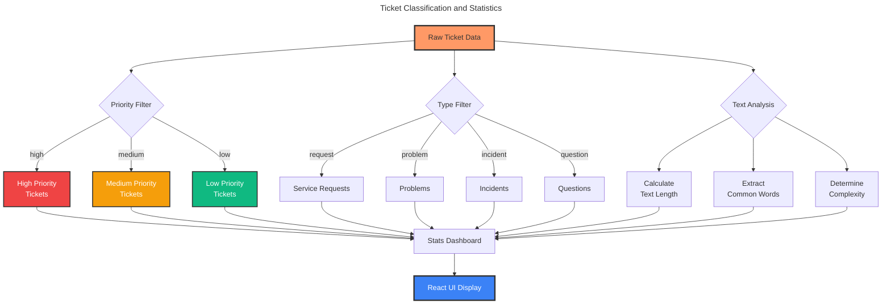

# TicketDB Entity-Relationship Diagram

## 🎨 Interactive Mermaid Diagrams

**To view and edit these diagrams interactively:**
1. Go to https://mermaid.js.org/ or https://mermaid.live/
2. Copy any code block below
3. Paste it into the editor
4. The diagram will render instantly!

---

## 1️⃣ Basic Database Schema

Copy this code into Mermaid Live Editor:



---

## 2️⃣ Extended Schema with Relationships

Copy this code for a more detailed view:



---

## 3️⃣ Application Architecture

Copy this for the full system architecture:



---

## 4️⃣ Data Flow Sequence Diagram

Copy this for API request/response flow:



---

## 5️⃣ Data Processing Flow

Copy this for data filtering and statistics:



---

## 📋 Field Mappings Reference

The application uses different field names than the database columns. The mapping is done in SQL SELECT queries:

| Database Column | API Field Name | Type | Description |
|----------------|----------------|------|-------------|
| `rowid` | `id` | int | Unique identifier |
| `subject` | `title` | string | Ticket subject/title |
| `body` | `description` | text | Detailed description |
| `type` | `status` | string | Current ticket status/type |
| `priority` | `priority` | string | Priority level |
| `queue` | `queue` | string | Support queue |
| `language` | `language` | string | Language code |

## 📊 Data Constraints

### Priority Values
- `low` - Low priority issues
- `medium` - Medium priority issues  
- `high` - High priority issues

### Type/Status Values
- `request` - Service requests
- `problem` - Technical problems
- `incident` - Critical incidents
- `question` - General questions

### Language Values
- `en` - English (only language in filtered database)

---

## 🔧 Technical Notes

### Database Details
- **Path**: `ITDB/data/english_support_tickets.db`
- **Type**: SQLite 3
- **Records**: ~1,000+ English support tickets
- **Access**: Python scripts (direct) + Node.js server (relative path)

### Key Design Decisions
1. **Single Table Design** - All ticket data in one `tickets` table for simplicity
2. **Column Aliasing** - Database columns mapped to cleaner API names in SELECT queries
3. **No Foreign Keys** - Standalone ticket records without user/department tables
4. **Text Storage** - `body` field as TEXT type for full descriptions
5. **Pre-filtered Data** - Database contains only English tickets

### SQL Query Example
```sql
-- This is how the server maps database columns to API fields
SELECT 
    rowid as id,
    subject as title,
    body as description,
    type as status,
    priority,
    queue,
    language
FROM tickets;
```

---

## 🚀 Quick Links

- **Live Editor**: https://mermaid.live/
- **Documentation**: https://mermaid.js.org/
- **GitHub Repo**: https://github.com/KalvinVar/TicketDB

---

## 💡 Tips for Using Mermaid Live Editor

1. **Copy any code block** from sections 1-5 above
2. **Paste into https://mermaid.live/**
3. **Edit in real-time** - changes render instantly
4. **Export options**: PNG, SVG, or copy link to share
5. **Theme options**: Try different themes in the editor settings

Enjoy visualizing your TicketDB architecture! 🎉
